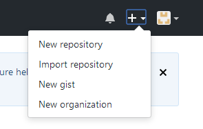
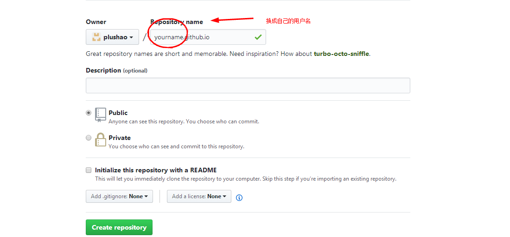
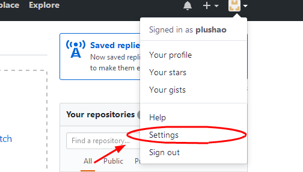
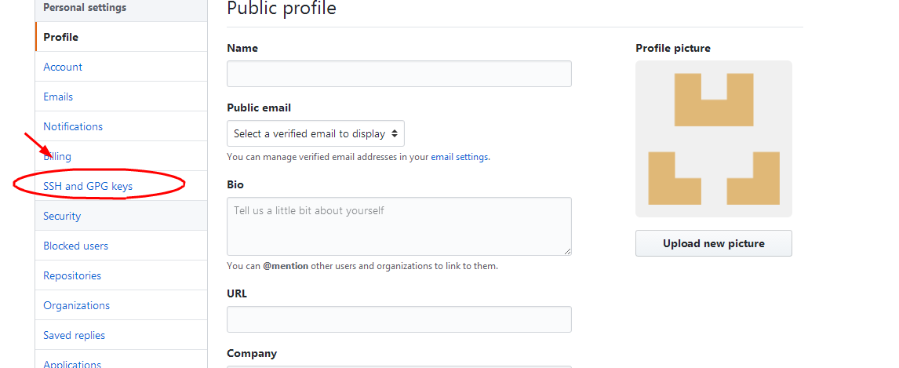
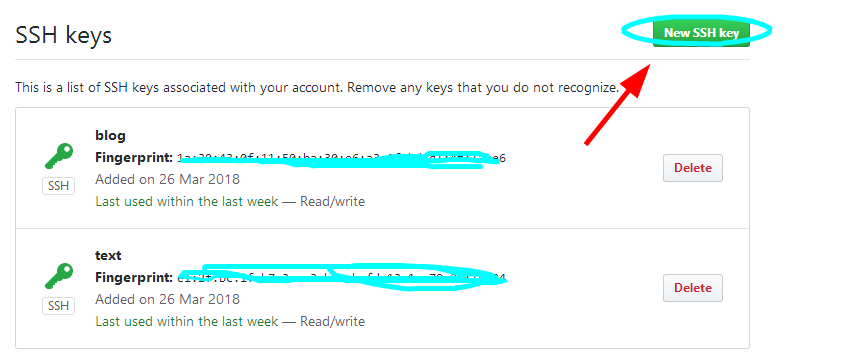
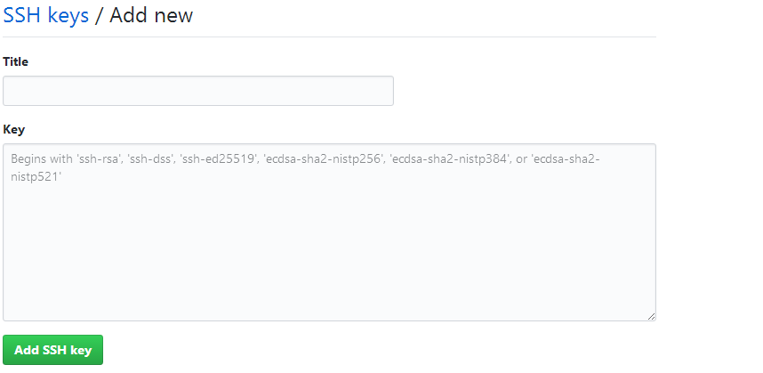

最近在尝试用Hexo和gitHub的方式搭建个人博客，现在将整个过程总结下，以及中间所遇到的坑。

>安装Git Bash

我的电脑系统是Windows系统，所以就直接下载其相应的版本。

- [下载地址](http://git-for-windows.github.io/)
- 安装步骤：一路下一步就好。

>安装nodejs
hexo是基于nodejs环境的博客,所以未来node中的工具会经常用到，所以现在下载个nodejs
- [下载地址](https://nodejs.org/en/)
- 安装步骤：下载好文件后，一路下一路，但是在Custom Setups时，记得选Add to PATH，j就可以不用再自己配置环境变量了。
- git Bash中运行 `node -v`,如出现相应的版本号，就说明nodeJs安装成功了。

> 链接到github中
 - 如果没有github，自行注册一个账号
 - 如下图，建立新的repo：
 
 
 - 在git Bash 中配置github账户信息：
    1. `$ git config --global user.name "你的用户名"`
    2. `$ git config --global user.email "你的邮箱"`
- 创建SSH
    1. 在git Bash中输入`ssh-keygen -t rsa -b 4096 -C "your_email@example.com"`其中的邮箱换成你的github的登录邮箱。
- 将上面获取的ssh加到github中：
    - 点击setting
    
    - 点击ssh and GPG keys
    
    - 点击 New SSH key
    
    - 填写ssh key（其中key中要填写的就是你上面创建SSh所得到的一串字符）
    
> 下载Hexo
- 进入一个安全目录
- 在git Bash中运行`npm install -g hexo-cli`,安装Hexo
- 然后依次运行下面几个
    - `hexo init myBlog`
    - `cd myBlog`
    - `npm i`
    - `hexo new 开博大吉`，你会看到一个 md 文件的路径
- 根据刚才返回的路径，打开相应的md文档，这个文档就是你的第一篇博文
- 编辑网站配置
    - `start _config.yml`
        - 把第 6 行的 title 改成你想要的名字
        - 把第 9 行的 author 改成你的大名
        - 把最后一行的 type 改成 type: git
        - 把最后一行的 type 改成 type: git
        - 在最后一行后面新增一行，左边与 type 平齐，加上一行 repo: 仓库地址(注意是以git@github.com：开头的仓库名， repo: 后面有个空格)
- `npm install hexo-deployer-git --save`，安装 git 部署插件
- 运行 `hexo deploy`
- 进入「你的用户名.github.io」对应的 repo，打开 GitHub Pages 功能，如果已经打开了，就直接点击预览链接

到此我们的hexo博客已经成功了。

> 如何更新博客文章呢

1. 运行`hexo new 第二篇文章的名字`
2. 复制显示的路径，使用 start 路径 来编辑它
3. 运行 `hexo generate`
4. 运行 `hexo deploy`
